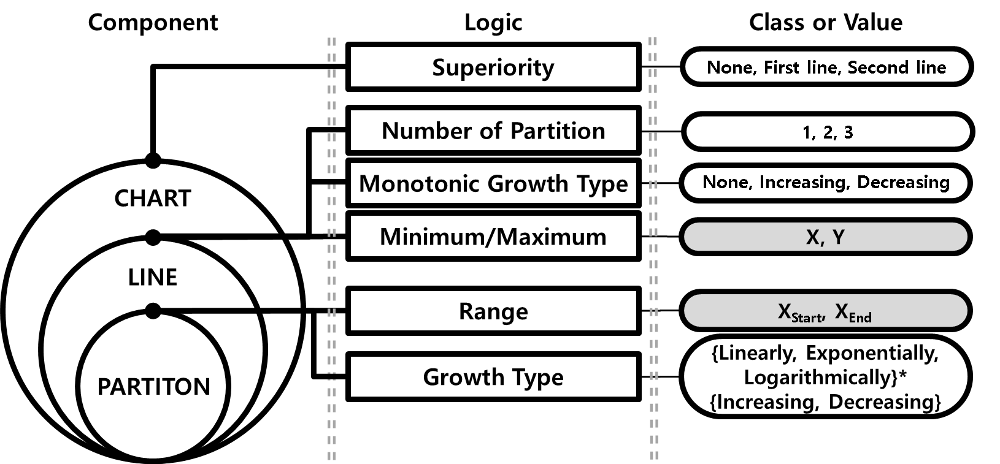
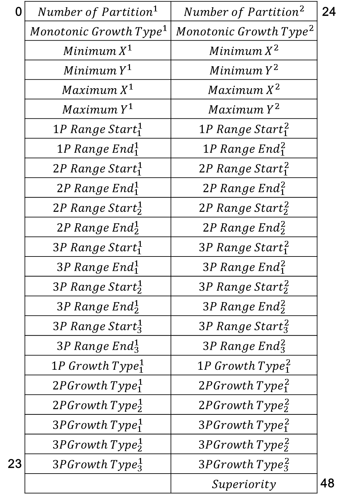

#### LCU Dataset Generator For Line Chart Understanding



This data generator is created for neural network supervised learning to understand line charts.
Images produce real-world-like data based on a variety of attributes. This dataset can be used to solve regression problems and classification of predefined subtasks.
When you create an image, labels are automatically created according to the meaning the chart describes.

Tested on **Windows** for Python **3.7**.
Anaconda 4.8.2 and Jupyter-lab

you can change `root_dir`, `DATA_SIZE`(recommand <100000)
To start LCU dataset generator:
```shell
# run main.ipynb
```

